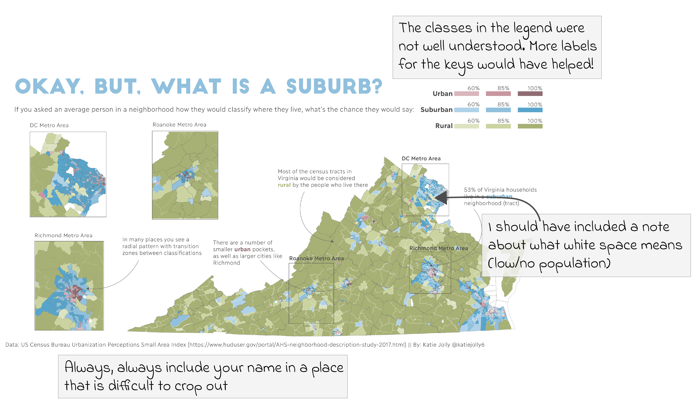
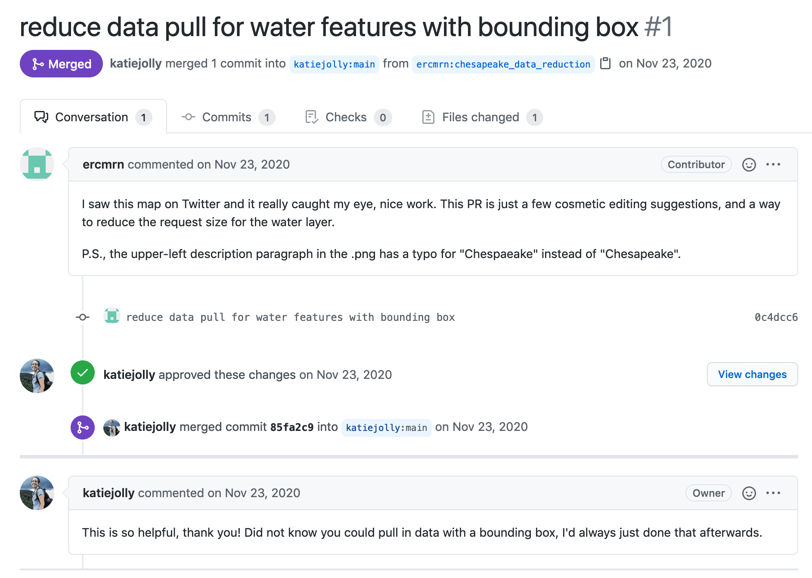

```{r setup, include=FALSE}
options(htmltools.dir.version = FALSE)
knitr::opts_chunk$set(
  fig.width=9, fig.height=3.5, fig.retina=3,
  out.width = "100%",
  cache = FALSE,
  echo = TRUE,
  message = FALSE, 
  warning = FALSE,
  fig.show = TRUE,
  hiline = TRUE
)
```

```{r xaringan-themer, include=FALSE, warning=FALSE}
library(xaringanthemer)
style_duo_accent(
  primary_color  = "#5B618A",
  secondary_color = "#F4E6A7",
  text_font_google = google_font("Lato"),
  code_font_google = google_font("Fira Mono"),
  header_font_google = google_font("Archivo", "300", "400"),
  text_font_size = 16
)
```

class: inverse center middle

# Why (and how) should we do data visualization critiques?

If you'd like to follow along with a transcript, you can go to this version of the slides:        [katiejolly.io/sharing-data-viz-june-2021-transcript](katiejolly.io/sharing-data-viz-june-2021-transcript)

---
class: split-four

.pull-left[

 
 
 <br>
 <br>
 
 
  
 ]
 
 .pull-right[
 
 <br>
 <br>
 <br>
 <br>
 <br>
 ## Some examples I'll discuss critiques for

 

 ]

---
class: inverse center middle

# Not all criticism is helpful or correct

<style>
.centerimg {
  display: block;
  margin-left: auto;
  margin-right: auto;
}
</style>

  
---

# People love to find themselves and compare to others (especially when it's a map)

  

On Reddit: 

> That southeast part of Richmond that is rural is called Varina and it is exactly like this map depicts. This oddly rural area abutting the city where you can go from near downtown to the middle of a bean field in a tenth of a mile or two.

---

# Annotations are great for guiding a reader's understanding



---

# Share your code because people may have tips you never thought to ask for



---

# There are many people online with niche insights that are hard to learn on your own


Alex Fries on Twitter:
 > Great map! I’ve looked at the dataset you used for it before—off the top of my head, I know it’s missing the Perdido River on the AL-FL border. There’s also the Pigeon, Pine, and Granite Rivers on the eastern MN-ON border, though those are easy to miss with all the lakes there!
 
---
 
# More reading/links I've mentioned:
 
* Presentation on accessibility for data visualization by Silvia Canelón and Liz Hare https://github.com/spcanelon/csvConf2021 
 
* Helpful alt text formula from Amy Cesal https://medium.com/nightingale/writing-alt-text-for-data-visualization-2a218ef43f81
 
* Post on data visualization citiques by Alli Torban https://www.tableau.com/about/blog/2019/5/critiquing-data-visualizations-channel-empathy-and-be-productive

* Policy Viz data visualization critiques https://policyviz.com/2021/06/03/new-video-series-data-visualization-critiques/
